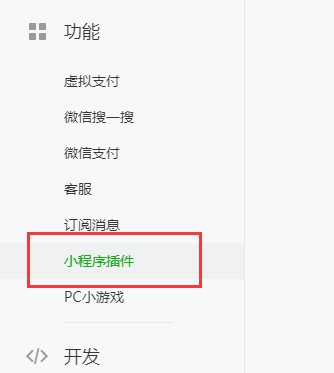

# 微信引擎插件发布流程

自 1.2 起，实际需要上传的引擎插件放置在编辑器打包路径的 resources 文件夹下的 3d/engine/bin/.cache/editor-cache/wechatgame 目录下。

## 下载项目包


https://github.com/cocos-creator/3d-wechat-engine-plugin

直接使用 git 拉取项目或者下载 zip 包即可。

## 插件包生成步骤

手动拷贝方式：

清空`cocosPlugin/plugin` 目录，将 `3d/engine/bin/.cache/editor-cache/wechatgame/cocos` 路径下的所有文件，直接复制到 `cocosPlugin/plugin` 目录下。

自动拷贝方式：

当前项目内放置了一个微信构建插件，在构建配置面板点击启用后直接构建就会生成对应的插件包。


## 测试阶段

使用微信开发者工具，用带有引擎插件开发权限的微信号登录后，打开 `cocosPlugin` 目录，并且确认是在**小游戏插件模式**下的即可。


1. **需要保证在编辑器内打开项目，以及预览都可以正常显示**
2. 在编辑器内打开当前项目，只勾选引擎分离选项，构建微信包。
3. 将构建成功的微信包除了 `cocos` 文件夹，复制到 `cocosPlugin/minigame` 文件夹内，并将项目内的 `game.json` 里的 `plugins` 字段改成下图所示。

```
  "plugins": {
    "cocos": {
      "version": "dev",
      "provider": "wx0446ba2621dda60a"
    }
  }
```

4. 一共需要构建拷贝 3 次，分别是不同物理引擎模块的选项；

## 上传发布阶段

在微信开发工具内直接点击 **上传** 按钮即可。


上传后，可以登录微信后台的小程序插件模块，开发版本看到最新的插件




最后点击提交审核，再发布即可。

## 注意点

1. 测试组测试通过后，直接上传插件包即可，可以留一份 zip 包文件到 ftp 后续传到 git 上；
2. 引擎组要以测试组上传的插件包作为发布版本；
